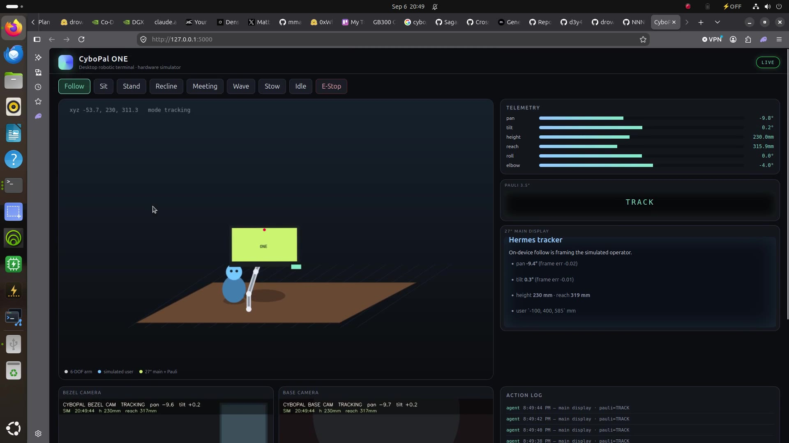

<p align="center"></p>

# keys · CyboPal ONE · Hermes DevKit + Live Simulator + Nemotron 3 Nano Omni · DGX Spark

Program, test, and control a **CyboPal ONE** before the USB-C robot lands on the desk. This is a Hermes embodiment kit for a single **NVIDIA DGX Spark (GB10)**: a live 6-DOF simulator you can drive from the browser, from JSON skills, or from **Nemotron 3 Nano Omni** tool calls.

[CyboPal ONE](https://cybopal.com/) is a 27″ 4K display on a 6-DOF arm (700 mm reach) with a 3.5″ Pauli companion, dual cameras, follow, and gesture. There is **no public SDK yet**. This repo freezes the REST contract so Hermes work done today maps onto the hardware later.

**Walkthrough (55 s, SimpleScreenRecorder):**
[play in repo](video/simplescreenrecorder.mp4) ·
[download](https://github.com/drowzeys/keys-CyboPal-ONE-Hermes-DevKit-LiveSimulator-Nemotron3Nano-Omni-for-DGX-Spark/releases/download/v0.1.0/simplescreenrecorder.mp4)

```bash
docker run --rm --network host \
  ghcr.io/drowzeys/keys-cybopal-one-hermes-devkit:0.1.0
# open http://127.0.0.1:5000/
```

Same image, long GHCR name (matches this repo):
`ghcr.io/drowzeys/keys-cybopal-one-hermes-devkit-livesimulator-nemotron3nano-omni-for-dgx-spark:0.1.0`

From git (venv fallback if you have no Docker):

```bash
git clone https://github.com/drowzeys/keys-CyboPal-ONE-Hermes-DevKit-LiveSimulator-Nemotron3Nano-Omni-for-DGX-Spark
cd keys-CyboPal-ONE-Hermes-DevKit-LiveSimulator-Nemotron3Nano-Omni-for-DGX-Spark
./oneshot.sh
# open http://127.0.0.1:5000/
```

| | |
|---|---|
| **Simulator** | FastAPI mock · 6-DOF arm · bezel + base cameras · Pauli + 27″ markdown |
| **Hermes** | `agent_core.py` — JPEG in, `update_cybopal_state` tool out |
| **Omni** | [`nvidia/Nemotron-3-Nano-Omni-30B-A3B-Reasoning-NVFP4`](https://huggingface.co/nvidia/Nemotron-3-Nano-Omni-30B-A3B-Reasoning-NVFP4) via vLLM |
| **Hardware** | 1× DGX Spark GB10 (or any box with Python 3.12 + a browser) |
| **Prebuilt image** | `ghcr.io/drowzeys/keys-cybopal-one-hermes-devkit:0.1.0` (linux/arm64) |
| **GPU** | Optional. Dashboard + skills + follow **do not** need a model |
| **GMU cap** | **≤ 0.85** — never raise `--gpu-memory-utilization` |

---

## One-shot

Prebuilt **linux/arm64** image (DGX Spark / GB10). Simulator needs **no GPU**. Omni weights are **not** in the image (~20 GB on Hugging Face).

```bash
docker pull ghcr.io/drowzeys/keys-cybopal-one-hermes-devkit:0.1.0
docker run --rm --network host ghcr.io/drowzeys/keys-cybopal-one-hermes-devkit:0.1.0
# same container + Hermes demo tracker:
docker run --rm --network host -e CYBOPAL_AGENT=1 \
  ghcr.io/drowzeys/keys-cybopal-one-hermes-devkit:0.1.0
```

`./oneshot.sh` pulls that image when Docker is present, otherwise a venv:

```bash
./oneshot.sh            # dashboard on :5000
./oneshot.sh --agent    # dashboard + Hermes demo tracker
./oneshot.sh --local    # skip docker, use ./venv
./oneshot.sh --omni     # print the vLLM command; does not occupy the GPU
```

Follow mode starts on boot. The arm chases a simulated operator in the bezel camera. Buttons on the dashboard (`Follow` `Sit` `Stand` `Recline` `Meeting` `Wave` `Stow` `Idle` `E-Stop`) hit the same `/api/v1/mode` Hermes uses.

### Program it

```bash
./scripts/cybopal.sh mode sit
./scripts/cybopal.sh pose pan=12 tilt=-6 height_mm=220
./scripts/cybopal.sh md skills/examples/briefing.md
./scripts/cybopal.sh skill skills/examples/wave-hello.json
./scripts/cybopal.sh skill skills/examples/posture-cycle.json
```

### Nemotron 3 Nano Omni (GPU)

Second terminal, only when you want the Spark busy:

```bash
bash scripts/serve-vllm.sh          # GMU 0.85 hard cap
python agent_core.py --mode vllm    # vision + tool calls into the mock
```

Details: [`docs/VLLM-SPARK.md`](docs/VLLM-SPARK.md). `agent_core.py --mode auto` uses vLLM when `:8000` answers, otherwise the on-device tracker.

---

## What you can do today vs when the unit ships

| Now (simulator) | Later (hardware) |
|---|---|
| 6-DOF pan / tilt / height / 700 mm reach | Same REST, vendor backend in `cybopal/device.py` |
| Synthetic bezel + base JPEG / MJPEG | Real cameras on the same paths |
| Pauli 3.5″ + 27″ markdown canvas | Same `pauli_text` / `display_markdown` |
| Firmware follow of a simulated person | Map CyboPal follow / wave-in / tap-to-stop onto `/api/v1/mode` |
| JSON skills + Hermes tool calls | Unchanged `agent_core.py` and `skills/examples/` |

---

## Repo layout

```
oneshot.sh                 venv + sim in one command
mock_device.py             FastAPI hardware sandbox + dashboard
agent_core.py              Hermes loop (demo | auto | vllm)
cybopal/device.py          6-DOF state, presets, follow PID
cybopal/cameras.py         synthetic bezel / base frames
static/                    live visual simulator
scripts/cybopal.sh         CLI: mode, pose, markdown, skills
scripts/serve-vllm.sh      Nemotron Omni on Spark, GMU ≤ 0.85
skills/examples/           JSON skills you can author and replay
.grok/skills/              Grok skill: /cybopal-hermes-devkit
video/simplescreenrecorder.mp4
docs/API.md  ARCHITECTURE.md  VLLM-SPARK.md
```

---

## HTTP contract

[`docs/API.md`](docs/API.md) — short form:

```bash
curl -s http://127.0.0.1:5000/api/v1/health
curl -s -X POST http://127.0.0.1:5000/api/v1/mode \
  -H 'content-type: application/json' -d '{"mode":"wave"}'
curl -s -X POST http://127.0.0.1:5000/api/v1/control \
  -H 'content-type: application/json' \
  -d '{"tilt":8,"pan":-12,"display_markdown":"# Hermes\nReady."}'
```

Authoring new skills: [`skills/README.md`](skills/README.md).

---

## Credits

Unofficial DevKit. CyboPal ONE is [CyboPal](https://cybopal.com/). Nemotron 3 Nano Omni is [NVIDIA](https://huggingface.co/nvidia/Nemotron-3-Nano-Omni-30B-A3B-Reasoning-NVFP4). Hermes is the Nous / local-agent loop this kit embodies. Spark fleet notes and GMU cap are keys / drowzeys.

## Support

Runs on self-funded DGX Spark hardware. If it is useful:
**https://www.gofundme.com/f/support-community-ai-with-dgxspark-gb10-gpu-and-macs**
